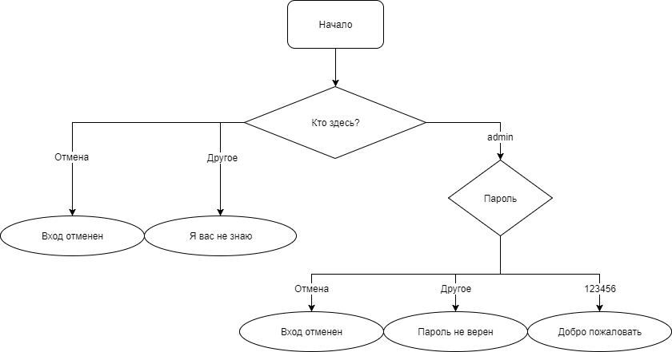

# Задание 1

Напишите код, который будет спрашивать логин (`prompt`).

Если посетитель вводит "admin", то спрашивать пароль, если нажал отмена (`значение == null`) -- выводить "Вход отменён", если вводит что-то другое -- "Я вас не знаю".

Пароль проверять так. Если введён пароль "123456", то выводить "Добро пожаловать!", иначе -- "Пароль неверен", при отмене -- "Вход отменён".

Блок-схема:




Для решения используйте вложенные блоки `if`. Обращайте внимание на стиль и читаемость кода.


# Задание 2

Перепишите `if` с использованием оператора '?' :

```javascript
if (a + b < 4) {
  result = 'Мало';
} else {
  result = 'Много';
}
```