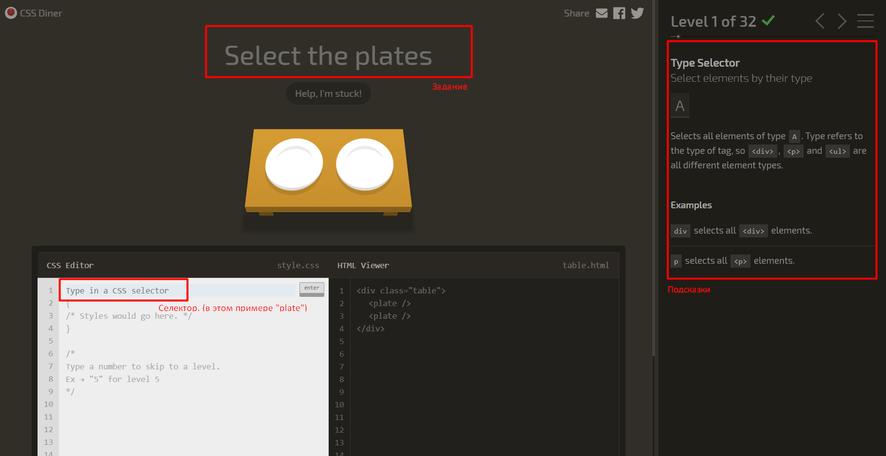

# Задание 1

1. Пройти все задания здесь: https://flukeout.github.io/
    
    
2. Дополнить [этот код](https://codepen.io/TheAvalanche/pen/KypmwX) так, чтоб при вводе пустого значения сообщение появлялось плавно, в течении 3 секунд (opacity).
    